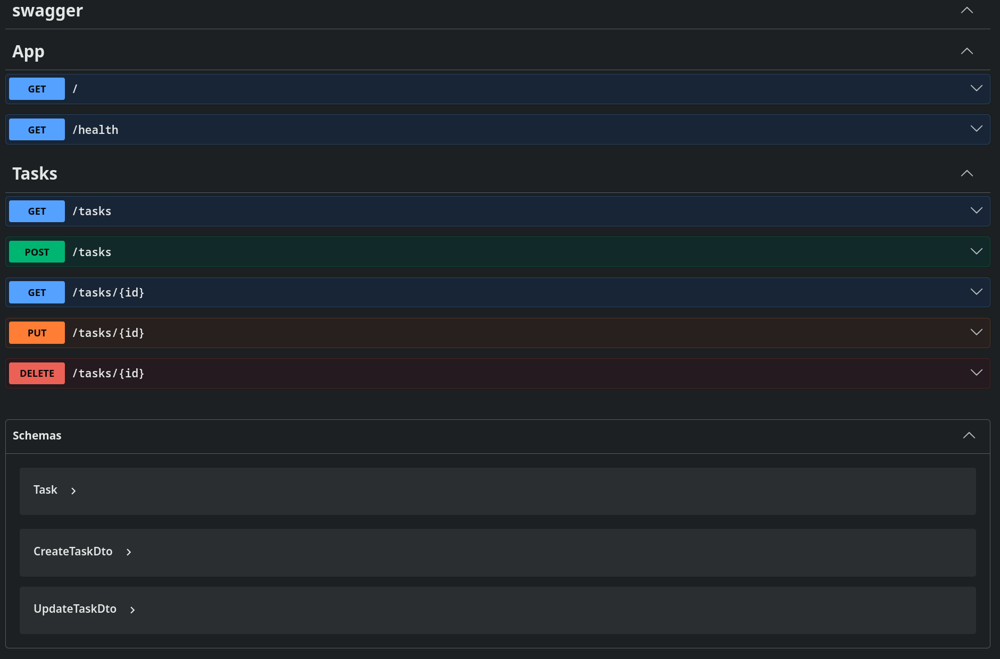

# To-do list API
A minimal [NestJS](https://nestjs.com/) REST API for a to-do list with in-memory storage, request validation, and Swagger documentation.


## Getting Started
### Prerequisites:

- Node.js (v18 or higher)
- npm / yarn / pnpm
- Nest CLI (optional, for scaffolding): `npm i -g @nestjs/cli`

### Run the project:

``` bash
$ pnpm install
$ pnpm run start
```
> *Note: the project uses pnpm package manager, npm will also work, but it will generate its own package-lock.json*

API will be available at http://localhost:3000.
<br>Swagger UI at http://localhost:3000/docs.


## Usage Example (curl)

### Request:
```bash
curl -i -X POST http://localhost:3000/tasks -H "Content-Type: application/json" -d '{"title":"Buy milk"}'
```

### Response:
```bash
HTTP/1.1 201 Created
X-Powered-By: Express
Content-Type: application/json; charset=utf-8
Content-Length: 40
ETag: W/"28-PpSBYV7i68cXyGc7AhjVpkZkY5Q"
Date: Sat, 18 Jul 2026 17:13:14 GMT
Connection: keep-alive
Keep-Alive: timeout=5

{"id":4,"title":"Buy milk","done":false}
```

## API Overview
### Table of all endpoints:

| CRUD operation | HTTP method | Example endpoint | Meaning |
| -------------- | ----------- | ----------------- | ------- |
| **C**reate | `POST` | `POST /tasks` | Add a new task |
| **R**ead | `GET` | `GET /tasks`<br>`GET /tasks/3` | List all tasks<br>get task 3 |
| **U**pdate | `PUT` | `PUT /tasks/3` | Change task 3 |
| **D**elete | `DELETE` | `DELETE /tasks/3` | Remove task 3 |

### Swagger UI:
**All endpoints and schemas:**


**POST `/tasks` endpoint:**
