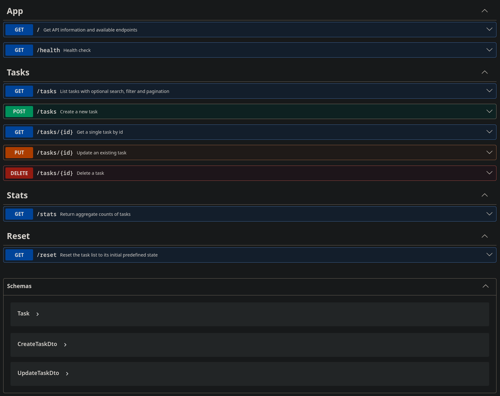
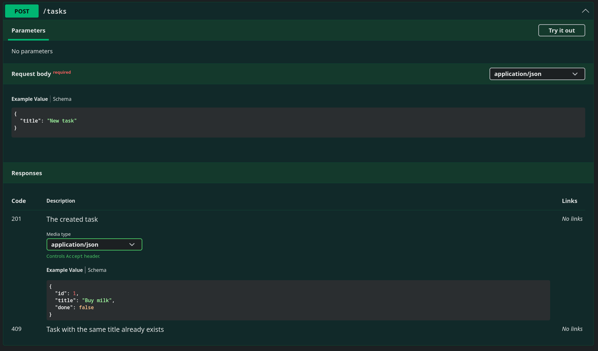

# To-do list API
A minimal [NestJS](https://nestjs.com/) REST API for a to-do list with in-memory storage, request validation, and Swagger documentation.


## Getting Started
### Prerequisites:

- Node.js (v18 or higher)
- npm / yarn / pnpm
- Nest CLI (optional, for scaffolding): `npm i -g @nestjs/cli`

### Run the project:

``` bash
$ pnpm install
$ pnpm run start
```
> *Note: the project uses pnpm package manager, npm will also work, but it will generate its own package-lock.json*

API will be available at http://localhost:3000.
<br>Swagger UI at http://localhost:3000/docs.


## Usage Example (curl)

### Request:
```bash
curl -i -X POST http://localhost:3000/tasks -H "Content-Type: application/json" -d '{"title":"Buy milk"}'
```

### Response:
```bash
HTTP/1.1 201 Created
X-Powered-By: Express
Content-Type: application/json; charset=utf-8
Content-Length: 40
ETag: W/"28-PpSBYV7i68cXyGc7AhjVpkZkY5Q"
Date: Sat, 18 Jul 2026 17:13:14 GMT
Connection: keep-alive
Keep-Alive: timeout=5

{"id":4,"title":"Buy milk","done":false}
```

## API Overview
### Table of all endpoints:

| CRUD operation | HTTP method | Example endpoint | Meaning |
| -------------- | ----------- | ----------------- | ------- |
| **C**reate | `POST` | `POST /tasks` | Add a new task |
| **R**ead | `GET` | `GET /tasks`<br>`GET /tasks/3` | List all tasks<br>get task 3 |
| **U**pdate | `PUT` | `PUT /tasks/3` | Change task 3 |
| **D**elete | `DELETE` | `DELETE /tasks/3` | Remove task 3 |

### Swagger UI:
**All endpoints and schemas:**


**POST `/tasks` endpoint:**


## Pagination

**Example:**
`GET /tasks?limit=2&offset=2`

Since the project does not use a database, pagination is implemented in memory by slicing the task array.  Database-backed APIs, by contrast, typically paginate on the backend by fetching records from the database in chunks, which saves resources and reduces loading times.

## AI vs me

The same application was generated in a separate branch by AI in less than 20 minutes: [AI-generated](https://github.com/elina-1201/to-do-list-api/tree/AI-generated)

**The given prompt:**
> Create backend api to-do list CRUD application in NestJS. It's going to have in memory array with three initial predifined tasks. example: {"id":"1","title":"Task 1", "done":"false"}. When implementing CRUD work only with array lists in memory, no database. New added task should have field done set to false and its id is the increment of the last task's id in list. Make pagination, search by title, filtering by "done" status possible (all query parametters should be optional). Return convinient http status codes for each action: 201 - adding, 204 - deleting, etc. Handle the errors that might appear, such as not found. Written code should be type safe. The fields that come from the client should be validated (use validation pipe with implicit transform). Set up swagger UI and make sure schemas are present, response and request schemas are documented inside endpoints. Additionaly create /reset endpoint that is going to reset tasks to initial state and /stats endpoint that returns: "total", "done", "open". Create /health endpoint that returns 200 ok and the root / endpoint returns endpoints info in json format. Write project documentation in README.md (description, getting started, prerequisites etc.)

**What did the AI do better:**
- generated the tests for the app
- added detailed descriptions for routes in swagger
- improved the response message from raw tasks to enveloped format

**What did it get wrong or quietly ignored from the prompt:**
- validation is not using implicit transformation, instead it has to transform passed fields explicitly
- swagger annotations are all placed in controller, which is too verbose
- there is no `409` handlers for `POST` and `PUT` endpoints

**What did my prompt forget to specify:**
- return message format for the tasks
- the exact structure of `README.md`
- pagination format: using `limit` and `offset` instead of `limit` and `page`

**What did the AI silently decide for me:**
- setting the whitelist in validation to `true` (forbids any other format than defined)

### Conclusion:
The generated application successfully started and every endpoint worked as expected. There were minor inconveniences that could be polished with a few more incremental prompts to get the result exactly as wanted. The reason those results were achieved is a detailed and clear prompt that wouldn't be possible without having expert knowledge in the field. So it could feel like "me **vs** AI", but I would rather say it's "me **and** AI", since a good quality product requires a human to:
- learn
- prompt
- review what is generated
- refine